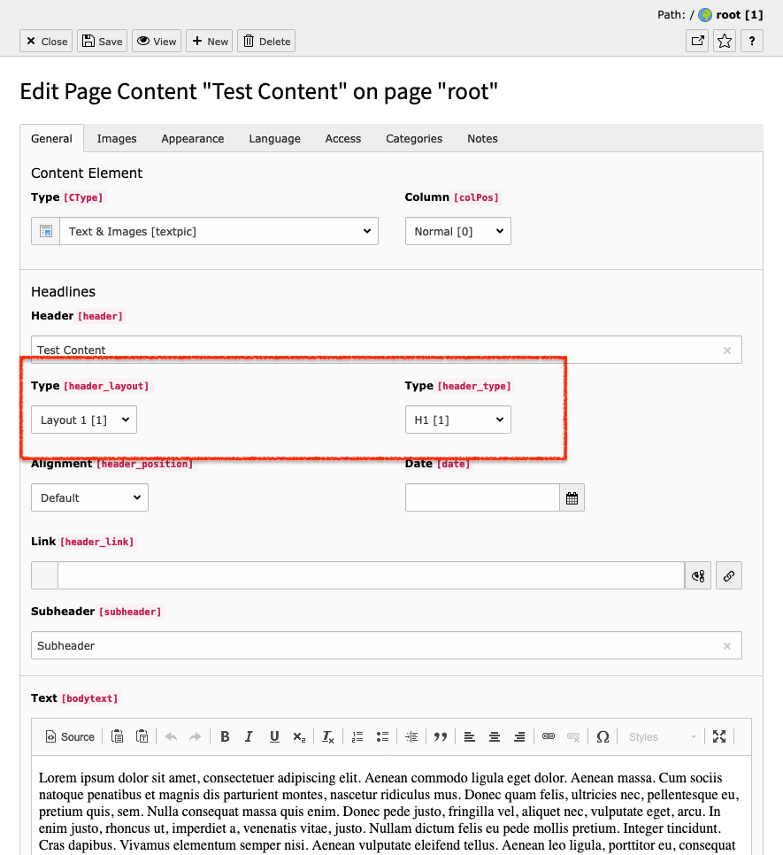
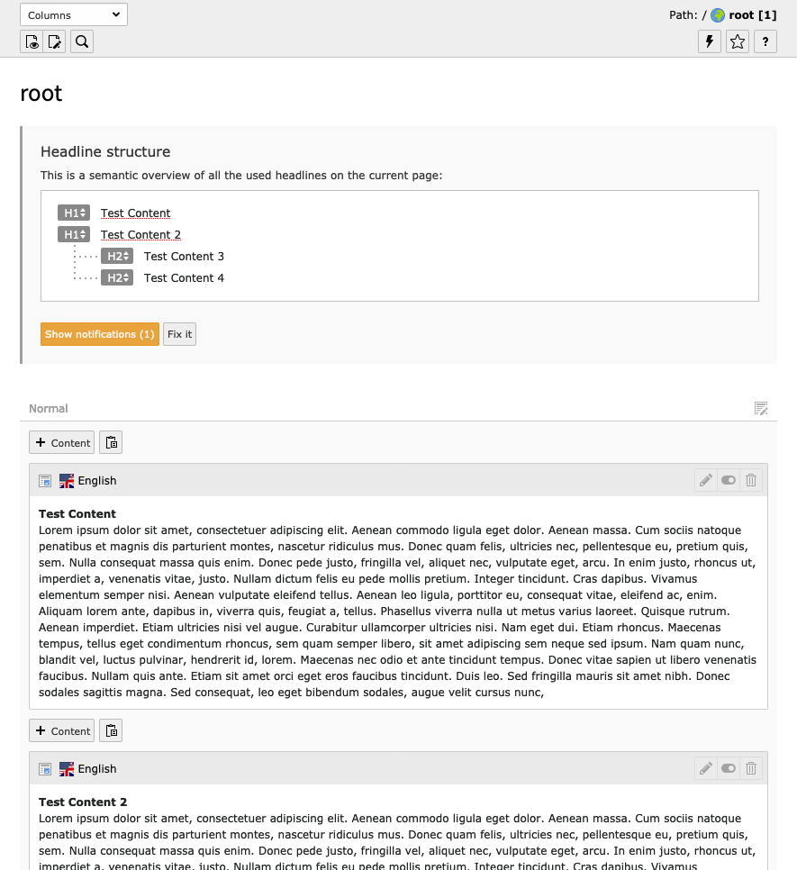
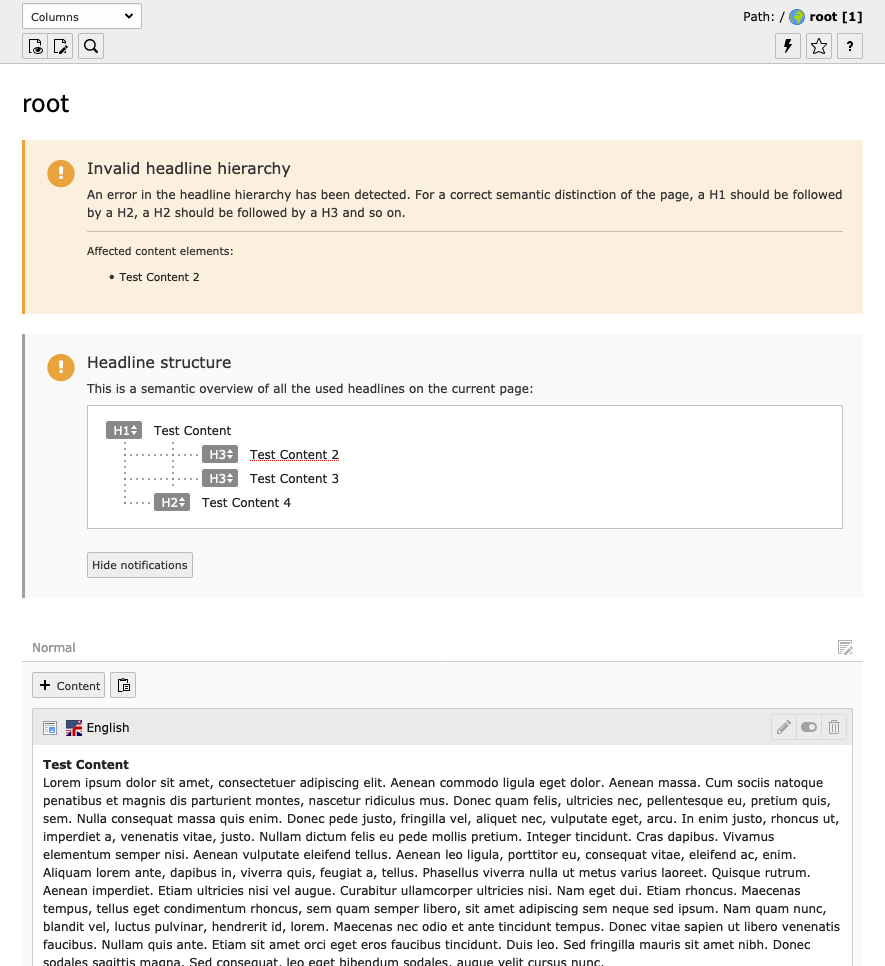

# The Semantilizer

## :question: What is it?

The Semantilizer is a TYPO3 extension, that adds more functionality to the TYPO3 own headlines of content elements. This extension will detach the semantic definition from the field `header_layout` for the headlines of the content elements. It also adds an overview over all currently used headlines in content elements across the current page. This will display also potential errors in the structuring of headlines and gives easy fixing options.

## :wrench: Installation

* Get the extension via composer: `composer require zeroseven/z7-semantilizer`
* Make sure the typoscript setup gets included **after** the configuration of fluid_styled_content to override their partials for the headlines
* Make sure you enable the extension in the backend
* That's it!

## :roller_coaster: How to use

You will find an understandable info box at the top of each page overview in the page module. This info box helps you figure out the current headline structure of the page and make necessary fixes right away.

For content elements you will find the before mentioned detachment of semantic meaning from the headlines.


If you have everything configured correctly and notifications enabled, your content will look like this:


If there are errors in your site configurations it is helpful, to turn on notifications:


The extension then show's you what's wrong with the current configuration and offers easy "Fix it"-Buttons that will fix your configuration and directly edit the ``header_type``.




## :point_right: Tips

If you want to make the labels of `header_layouts` more understandable, overwrite them like so:

```tsconfig
TCEFORM.tt_content {
    header_layout {
      removeItems = 2
      altLabels.. = Medium
      altLabels.1 = Larger
      altLabels.3 = Smaller
      addItems.fancy_pink_sparkling_turned_around_bouncing_header = The nice one!
    }
}
```


## Options 

You can disable the preview of the headlines on some pages. To achieve this, add this to your PageTSConfig;

```
tx_semantilizer.disableOnPages = 42,84
```

You can also disable the headline checking for specific content elements, like so

```
tx_semantilizer.ignoreCTypes = div, html
```

## Todo's

* There is currently no support or concept for multi language pages
* It's currently not properly working for pages where the H1 headline is coming from site properties
